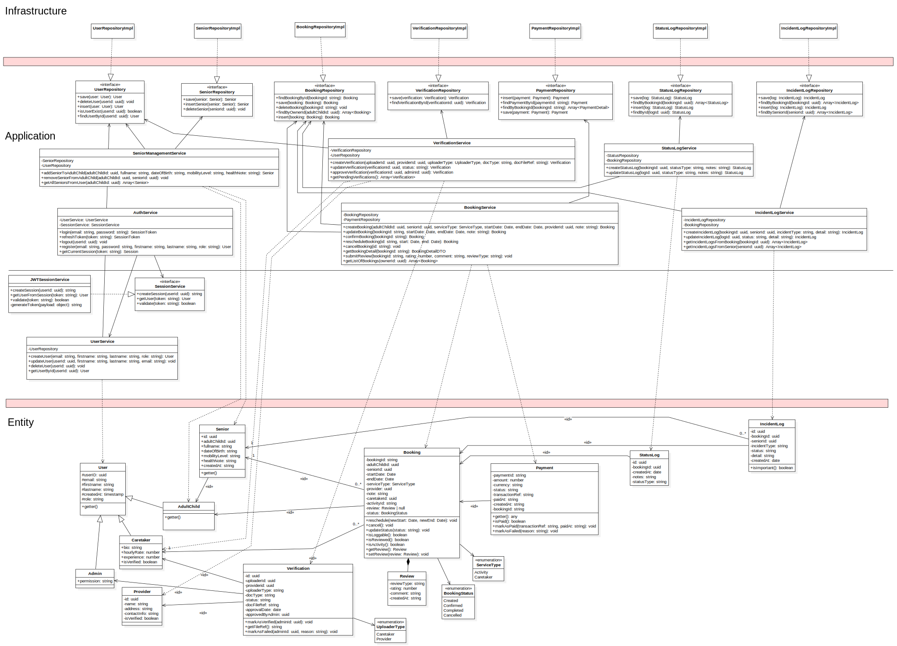

# System Overview — oonjai-core-service

> Runtime: **Bun** · Language: **TypeScript (strict)** · Architecture: **Domain-Driven Design (DDD)**

---

## Table of Contents

1. [Full System Diagram](#1-full-system-diagram)
2. [Project Structure](#2-project-structure)
3. [Architecture Overview](#3-architecture-overview)
4. [Layer Reference](#4-layer-reference)
   - [Types](#41-types--typetype)
   - [Entities & DTOs](#42-entities--dto--entityentityts--entityentitydtots)
   - [Repositories](#43-repositories--repositoryirepositoryts)
   - [Services](#44-services--servicesservicets)
   - [HTTP Infrastructure](#45-http-infrastructure--http)
   - [Endpoints](#46-endpoints--endpoint)
5. [Path Aliases](#5-path-aliases)
6. [How to Add a New Endpoint](#6-how-to-add-a-new-endpoint)
7. [Endpoint Registration Flow](#7-endpoint-registration-flow)
8. [Conventions](#8-conventions)

---

## 1. Full System Diagram



The diagram is organised into three horizontal swim lanes:

| Lane | What's in it |
|------|-------------|
| **Infrastructure** | `TestFSDatabase`, `TestUserRepository`, `TestSeniorRepository`, `BunAdapter`, `Router`, `EndpointRegistry` — all I/O and framework-facing code |
| **Application** | `UserService`, `SeniorManagementService`, all `Endpoint` files — orchestration and HTTP handling |
| **Entity** | `User`, `UserDTO`, `Senior`, `SeniorDTO`, `UUID`, `Timestamp`, `RoleEnum` — pure domain model with no external dependencies |

Dependency arrows flow **downward only** (Application → Entity, Infrastructure → Application). No upward arrows exist — inner layers never know about outer layers.

---

## 2. Project Structure

```
src/
├── index.ts                        # Entry point — wires everything, chains registry.register()
│
├── type/                           # Primitive domain types
│   ├── uuid.ts
│   ├── timestamp.ts
│   └── user.ts                     # RoleEnum
│
├── entity/                         # Domain entities + DTOs
│   ├── User.ts
│   ├── UserDTO.ts
│   ├── Senior.ts
│   └── SeniorDTO.ts
│
├── repository/                     # Data access contracts + implementations
│   ├── IUserRepository.ts
│   ├── TestUserRepository.ts
│   ├── ISeniorRepository.ts
│   └── TestSeniorRepository.ts
│
├── services/                       # Business logic
│   ├── IService.ts                 # Re-exports IService from @http/HttpContext
│   ├── UserService.ts
│   └── SeniorManagementService.ts
│
├── http/                           # HTTP infrastructure (framework-agnostic)
│   ├── HttpContext.ts              # Core types: IService, Endpoint, Handler, response helpers
│   ├── Router.ts                   # Path matching + dispatch
│   ├── EndpointRegistry.ts        # Chained registration with per-service logging
│   └── BunAdapter.ts              # Bun.serve() adapter
│
├── endpoint/                       # One file = one REST endpoint
│   ├── users/
│   │   ├── createUser.ts
│   │   ├── getUserById.ts
│   │   └── updateUser.ts
│   └── seniors/
│       ├── addSenior.ts
│       ├── getAllSeniors.ts
│       └── removeSenior.ts
│
└── lib/                            # Infrastructure utilities
    ├── TestDatabase.ts             # ITestDatabase interface
    └── TestFSDatabase.ts          # File-based JSON implementation (database.json)
```

---

## 3. Architecture Overview

```
┌─────────────────────────────────────────────────┐
│                   index.ts                       │
│   registry                                       │
│     .register(updateUser,    [userService])      │
│     .register(addSenior,     [seniorService])    │
│     .register(getAllSeniors, [seniorService])    │
└───────────────────────┬─────────────────────────┘
                        │
          ┌─────────────▼──────────────┐
          │      EndpointRegistry      │
          │  logs + calls router.route │
          └─────────────┬──────────────┘
                        │
          ┌─────────────▼──────────────┐
          │          Router            │
          │  path match + dispatch     │
          └─────────────┬──────────────┘
                        │
          ┌─────────────▼──────────────┐
          │    Endpoint<S[]> file      │
          │  handler(ctx, [service])   │
          └─────────────┬──────────────┘
                        │
          ┌─────────────▼──────────────┐
          │         Service            │
          │  implements IService       │
          └─────────────┬──────────────┘
                        │
          ┌─────────────▼──────────────┐
          │        Repository          │
          │  interface + impl          │
          └─────────────┬──────────────┘
                        │
          ┌─────────────▼──────────────┐
          │  TestFSDatabase (JSON)     │
          └────────────────────────────┘
```

DDD layers are strictly one-directional — outer layers depend on inner layers, never the reverse:

```
Endpoint → Service → Repository → Database
```

---

## 4. Layer Reference

### 4.1 Types — `@type/*`

Primitive value objects shared across all layers.

| File | Export | Purpose |
|------|--------|---------|
| `uuid.ts` | `UUID extends String` | Type-safe identifier |
| `timestamp.ts` | `Timestamp`, `TimestampHelper` | Millisecond timestamps with helpers |
| `user.ts` | `RoleEnum` | `adult_child`, `admin`, `caretaker` |

---

### 4.2 Entities & DTO — `@entity/Entity.ts` + `@entity/EntityDTO.ts`

Entities are the domain model. They hold state and domain logic. DTOs are plain objects for serialisation.

**Pattern:**
```ts
// Entity accepts both its own DTO (for rehydration) and raw params (for creation)
class User {
  constructor(dto: UserDTO)                // rehydrate from storage
  constructor(email, firstname, ..., role) // create new domain object

  isNew(): boolean         // true if no id assigned yet
  toDTO(): UserDTO         // serialise to plain object
  getId(): UUID
  setFirstname(v: string)  // controlled mutation
}
```

**Rule:** Services are the only callers of `new Entity(...)`. Never construct entities in endpoints or repositories.

---

### 4.3 Repositories — `@repo/IRepository.ts`

Contracts for data access. Business logic never imports a concrete repository class.

```ts
interface IUserRepository {
  insert(user: User): UUID
  findById(id: UUID): User | undefined
  save(user: User): boolean
  delete(user: User): void
}
```

Current implementations (`TestUserRepository`, `TestSeniorRepository`) use `ITestDatabase` backed by `database.json`. Swap implementations in `index.ts` — services are unaware.

---

### 4.4 Services — `@serv/ServiceName.ts`

Services hold all business logic. Every service **must** implement `IService`.

```ts
// defined in @http/HttpContext, re-exported by @serv/IService
export interface IService {
  getServiceId(): string   // used by EndpointRegistry for logging
}
```

```ts
export class UserService implements IService {
  getServiceId(): string { return "UserService" }

  createUser(email, firstname, lastname, role): UUID
  getUserById(id: UUID): User | undefined
  updateUser(id: UUID, data: Partial<...>): void
}
```

```ts
export class SeniorManagementService implements IService {
  getServiceId(): string { return "SeniorManagementService" }

  addSeniorToAdultChild(adultChildId, fullname, dob, mobility, note): Senior
  removeSeniorFromAdultChild(adultChildId, seniorId): void
  getAllSeniorsFromUser(adultChildId): Senior[]
}
```

**Rule:** Services receive repository interfaces via constructor injection. No service imports another service.

---

### 4.5 HTTP Infrastructure — `@http/*`

#### `HttpContext.ts` — core contracts

```ts
interface IService {
  getServiceId(): string
}

interface HttpContext {
  params:  Record<string, string>   // path params: /users/:id → params.id
  query:   Record<string, string>   // ?key=value
  headers: Record<string, string>
  body:    unknown                  // parsed JSON
}

interface HttpResult { status: number; body?: unknown }

// S is a tuple of IService — destructured in the handler
type Handler<S extends IService[]> = (ctx: HttpContext, services: S) => Promise<HttpResult>

type Endpoint<S extends IService[] = IService[]> = {
  method:  "GET" | "POST" | "PUT" | "PATCH" | "DELETE"
  path:    string          // supports :param segments
  handler: Handler<S>
}

// Response helpers
ok(body?)           → 200
created(body?)      → 201
noContent()         → 204
notFound(msg?)      → 404
badRequest(msg?)    → 400
internalError(msg?) → 500
```

#### `Router.ts`

Matches incoming requests by method + path segments. Extracts `:param` values into `ctx.params`. Wraps handler execution in try/catch — any thrown `Error` becomes a `500` with `err.message`.

#### `EndpointRegistry.ts`

```ts
class EndpointRegistry {
  register<S extends IService[]>(endpoint: Endpoint<S>, services: S): this
}
```

- Reads `service.getServiceId()` from each service and logs:
  `Registered POST /users  UserService`
- Calls `router.route(endpoint, services)` internally
- Returns `this` — designed for chaining

#### `BunAdapter.ts`

Translates `Bun.serve()` requests into `HttpContext`, calls `router.dispatch()`, and serialises `HttpResult` back to a `Response`. Swap this file to support other runtimes without touching anything else.

---

### 4.6 Endpoints — `@endpoint/domain/actionName.ts`

Each file exports **a single named `Endpoint` constant** — no classes, no factories, no state.

```ts
// src/endpoint/users/updateUser.ts
export const updateUser: Endpoint<[UserService]> = {
  method: "PUT",
  path: "/users/:id",
  handler: async (ctx, [service]) => {
    const body = ctx.body as Record<string, unknown>
    service.updateUser(new UUID(ctx.params.id!), { ... })
    return ok()
  },
}
```

The service tuple is declared in the generic `Endpoint<[...]>`. The registry binds the real service instances at registration time — the endpoint file itself has **no runtime service dependency**.

---

## 5. Path Aliases

| Alias | Resolves to |
|-------|-------------|
| `@type/*` | `src/type/*` |
| `@entity/*` | `src/entity/*` |
| `@repo/*` | `src/repository/*` |
| `@serv/*` | `src/services/*` |
| `@http/*` | `src/http/*` |
| `@endpoint/*` | `src/endpoint/*` |

---

## 6. How to Add a New Endpoint

> Example: `GET /users` — list all users.

### Step 1 — Add the service method (if needed)

```ts
// src/services/UserService.ts
public getAllUsers(): User[] {
  return this.userRepo.getAll()
}
```

### Step 2 — Create the endpoint file

```ts
// src/endpoint/users/getAllUsers.ts
import type {Endpoint} from "@http/HttpContext"
import {ok} from "@http/HttpContext"
import type {UserService} from "@serv/UserService"

export const getAllUsers: Endpoint<[UserService]> = {
  method: "GET",
  path: "/users",
  handler: async (ctx, [service]) => {
    const users = service.getAllUsers()
    return ok(users.map(u => u.toDTO()))
  },
}
```

### Step 3 — Register it in `index.ts`

```ts
import {getAllUsers} from "@endpoint/users/getAllUsers"

registry
  .register(getAllUsers, [userService])   // ← add this line
  .register(updateUser, [userService])
  // ...
```

That's it. One file, one import, one `.register()` line.

---

### Adding an endpoint that uses multiple services

Extend the tuple type with every service the handler needs:

```ts
// src/endpoint/reports/seniorSummary.ts
import type {Endpoint} from "@http/HttpContext"
import {ok} from "@http/HttpContext"
import type {UserService} from "@serv/UserService"
import type {SeniorManagementService} from "@serv/SeniorManagementService"

export const seniorSummary: Endpoint<[UserService, SeniorManagementService]> = {
  method: "GET",
  path: "/reports/seniors/:adultChildId",
  handler: async (ctx, [userService, seniorService]) => {
    // both services are fully typed here
  },
}
```

```ts
// index.ts
registry.register(seniorSummary, [userService, seniorManagementService])
```

---

### Adding a brand new domain (e.g. Caretakers)

1. Create `src/entity/Caretaker.ts` + `CaretakerDTO.ts`
2. Create `src/repository/ICaretakerRepository.ts` + implementation
3. Create `src/services/CaretakerService.ts` implementing `IService`
4. Create endpoint files under `src/endpoint/caretakers/`
5. In `index.ts`: instantiate repo → service → chain `.register()` calls

---

## 7. Endpoint Registration Flow

```
index.ts
  registry
    .register(updateUser, [userService])
    │  ├── logs: Registered PUT /users/:id  UserService
    │  └── router.route(updateUser, [userService])
    │         └── stores: { method: PUT, segments: [users, :id],
    │                        invoke: (ctx) => updateUser.handler(ctx, [userService]) }
    │
    .register(addSenior, [seniorManagementService])
       ├── logs: Registered POST /users/:adultChildId/seniors  SeniorManagementService
       └── router.route(...)

Runtime: PUT /users/abc-123
  └── BunAdapter.fetch()
        └── router.dispatch("PUT", "/users/abc-123", ctx)
              └── matched route → invoke({ ...ctx, params: { id: "abc-123" } })
                    └── updateUser.handler(ctx, [userService])
                          └── userService.updateUser(id, data)
                                └── userRepo.save(user)
                                      └── TestFSDatabase → writes database.json
```

---

## 8. Conventions

| Rule | Detail |
|------|--------|
| **One endpoint per file** | File name = HTTP action (`createUser.ts`, `addSenior.ts`) |
| **Endpoints are static constants, not factories** | `export const myEndpoint: Endpoint<[...]> = { ... }` |
| **Services are bound at registration, not imported** | Endpoint files only import service *types*, never instances |
| **No business logic in endpoints** | Validate request shape → call service → return `HttpResult`. Nothing more. |
| **No service depends on another service** | Cross-domain coordination belongs in a dedicated orchestration service |
| **Entities never leave the service layer raw** | Always call `.toDTO()` before returning from a handler |
| **All services implement `IService`** | Required for `EndpointRegistry` logging and type safety |
| **Repository interfaces only in services** | Services declare deps as interfaces (`IUserRepository`), never concrete classes |
| **Commit messages follow Conventional Commits** | Enforced by commitlint + husky |
